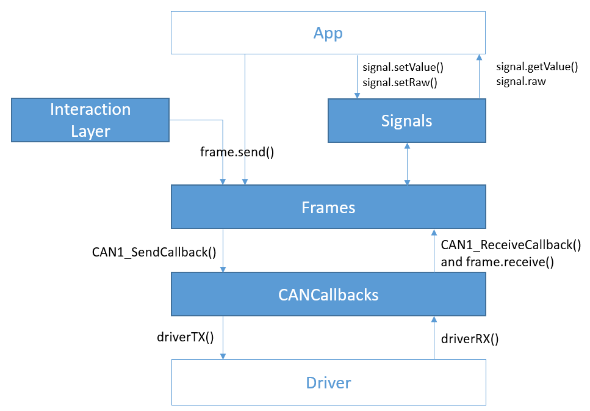
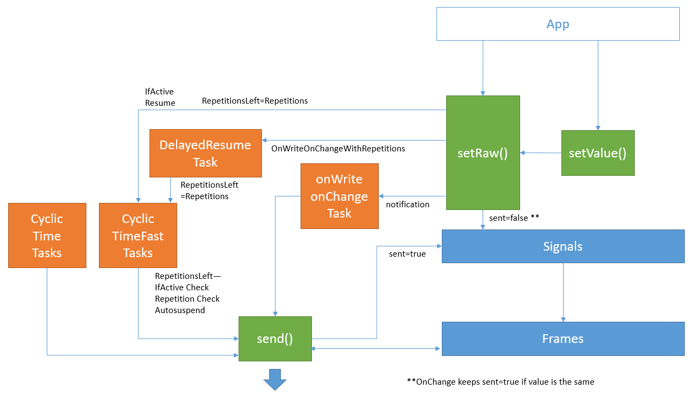
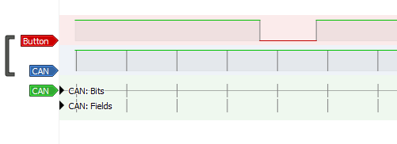

# Cantata
*Warning!* This is a work in progress, and it doesn't have proper testing done to it. Use at your own risk!

This Python module extracts information from CANdb Databases and generates C code for integration into embedded projects. The code is environment agnostic, it can be integrated into any MCU in theory. Example files to integrate it into STM32 using HAL from ST are included in this repo.\
The candb library used for reading the dbc files ([cantools](https://cantools.readthedocs.io/en/latest/)) also accepts other formats, but it hasn't been tested.
## Install
You can install the package from PyPi: https://pypi.org/project/python-cantata/
```bash
pip install python-cantata
```
Alternatively it can be installed from the git repository. Cloning the project and installing the pipenv for development

```bash
git clone https://github.com/polfeliu/cantata
cd cantata
pip install pipenv #if you don't have pipenv...
pipenv install
pipenv shell
```

## Usage
Generating files from database is pretty simple, just create a python file and execute it every time you change the database. This script must import the module, load the database, process it, and the module will generate .c and .h files according to the choosen options.
When creating the _cantata_ object a prefix must be passed, that will give the starting name of all objects in files (messages, signals, value tables...). All the prefixes in this readme are CAN1 for simplicity purposes.
This is important for ECU's that are connected to multiple buses, specially if objects in the databases share names.  

```python
from cantata import Cantata
can = Cantata("CAN1") # create the object setting the prefix that will be used in all objects.
#Handy if you have several networks

can.load('./test/CAN1.dbc')# Import database

src = r'./test/STM32TestProject/Core/Src/' #Where Source files should be copied to
hdr = r'./test/STM32TestProject/Core/Inc/' #Where Header files should be copied to

can.correctMinsMax() # Correct the minimums and maximums
can.process(node="Engine") #Generate for the Node Engine
can.process() # you can also generate all messages and signals without specifying the node

can.genFiles(src=src, hdr=hdr);
can.reset() #you can reset the data to be able to generate a new Node in another place
```

The function _process_ will extract the signals and frames of the database. The _node_ parameter passed indicates which node is the code for, meaning only the frames and signals necessary will be in the code. 

Frames transmitted by the ECU will only have send() methods. Frames received will only have receive().\
Signals will always have getValue() methods and only setValue() methods if they are TX. \
Even though RX messages may have signals that are not RX declared in the database but are actually received they won't have an object to access them, forcing you to keep the database consistent if you want to access the signals ;). 

If no node is passed to the process function (``` can.process()```) the function will calculate all the frames signals and methods. 

### Settings
This library has a series of settings that are documented across this readme. They can be changed from the default ones by accessing the settings dictionary

``` python
can.settings["CallbackLib"] = "STM32CANCallbacks" #name of the library that implementes the Callback functions for this bus
```

### Mins and Max
I've found that many databases tend to have the mins and maxs of signals not calculated (because in the CANdb++ editor you have to click a button to update them).\
To prevent mysterious errors when executing the program I programmed a cool optional feature: When you process a signal it checks that the mins and max are correct. If a signal fails the program halts and prints an error.\
This check can be disabled by setting _checkminmax_ to False on the settings

The function correctMinsMax() can be called before processing the node and it simply recalculates all the mins and maxs to the cache, so that when you call the process() function it doesn't fail.
To store the new mins and maxs to a .dbc file you can call the function ``can.save("file")``.

### Filters
The library calculates a standard ID and a extended ID hardware filters (filter and mask) for the RX messages of the node. This can be used to reduce the software load. The filters are declared in the header file

```c
// PassRatio: 67.0 %  // Messages that this ECU Reads
// MatchedRatio: 67.0 %  // Messages that the Filters lets pass
// Efficiency: 100.0 %  // Effiency of the filter (passRation/matchedRatio)

#define CAN1_StandardFilter   0b01100000000
#define CAN1_StandardMask     0b10010011000
#define CAN1_ExtendedFilter   0b00000000000000000000000000000
#define CAN1_ExtendedMask     0b11111111111111111111111111111
```
More on CAN controller hardware filters: http://www.cse.dmu.ac.uk/~eg/tele/CanbusIDandMask.html

In the STM32CANCallbacks.c files there is an initialization of the CAN that includes the configuration of the bxCAN filters.

## Structure
The library generates cantataCAN1.c and cantataCAN1.h files with structures and functions for the following objects.



### Signals
The signal structure contains basic information of the signal provided by the database:
* **length**: Length in bits of the signal
* **(optional)byte_order**: Byte order represented with enumerated type of the signal big_endian or little endian
* **(optional)unit**: Units of the signal (String)
* **(optional)initial_value**: Initial value of the signal
* **factor**: Factor to get physical value from raw value
* **offset**: Offset to get physical value from raw value
* **min**: Minimum physical value of the signal
* **max**: Maximum physical value of the signal

And also own elements of the library:
* **value_type**: indicates in what type the raw signal will be stored
* **raw**: stores the raw signal, can be used to get the raw value
* **getValue**: pointer to function that returns the physical value according to the factor and offset
* **setValue**: pointer to function that sets the raw value (with the physical value passed as an argument) according to the factor and offset
* **setRaw**: pointer to function that sets the raw value
* **(optional) sent**: Boolean that indicates if the signal value has been sent by the Interaction Layer.
* **(optional) inactiveValue**: Indicates the signal inactive value if the interaction layer is activated and the sent type is IfActive 
```c
struct CAN1sig_SleepInd_t CAN1sig_SleepInd = {
    .length = 1,
    .byte_order = little_endian,
    .value_type = Tbool,
    .unit = "",
    .initial_value = 0,
    .factor = 1,
    .offset = 0,
    .min = 0,
    .max = 1,
    .raw = 0,
    .getValue = CAN1sig_SleepInd_getValue,
    .setValue = CAN1sig_SleepInd_setValue,
    .setRaw = CAN1sig_SleepInd_setRaw,
    .sent = true
};
```

#### getValue
```c
sleep = CAN1sig_SleepInd.getValue();
```
#### setValue
```c
sat = CAN1sig_SleepInd.setValue(34);
```
setValue checks if the value passed exceeds the signal maximum and minimum and saturates it accordingly. It also returns a boolean that informs if the value saturated.


#### setRaw
```c
CAN1sig_SleepInd.setRaw(34);
```

#### Value Tables
Signals can have Value tables associated to represent states, errors or others. These are automatically defined as enumerated types that are easily accessed. 

Enumerated datatypes can only have a code for each name, but value tables can have more than one. If this is the case the code generation will throw a warning and assign one of the possible values to the name.
```c
typedef enum {
    CAN1sig_StatusVT_Error=3,
    CAN1sig_StatusVT_GoSleep=2,
    CAN1sig_StatusVT_Running=1,
    CAN1sig_StatusVT_WakeUp=0,
}CAN1sig_StatusVT_t;
```
They can be used with setValue and getValue methods
```c
CAN1sig_Status.setValue(CAN1sig_StatusVT_WakeUp);
```


### Frames
Frames have similar structs with data from the database:
* **ID**: Identifier of the message.   
* **is_extended**: Boolean indicating if the indentifier is of extended format (equivalent to XTD)
* **DLC**: Data Length Code declared in the database (for messages with DLC less or equal to 8, DLC=Number of bytes)

And also own elements of the library:
* **raw**: Holds the raw message with union of bytes and raw signals structs. This shouldn't be used by the application.
* **send**:  packs all the signals to the frame raw parameter and calls CAN1_SendCallback() with the frame calculated (more on that later). Also reverses bits of big endian signals. 
* **receive**: unpacks the raw message and store the values of the signals to the signals raw parameter. Signals with big endian encoding are reversed on this process. 
* **on_receive** Pointer to function that is called every time a message is received.

The code generation for receive and send methods support both multiplexing and extended multiplexing.

If InteractionLayer is activated and the message contains a signal with send type with repetitions:
* **repetitions**: Number of repetitions that are sent
* **repetitions_left**: Number of repetitions that are left to send

If the network is of type CANFD (Attribute BusType = "CAN FD") the struct will also have:
* **(optional)FDF**: Boolean Indicating if frame is of type Flexible Data Format
* **(optional)BRS**: Boolean Indicating if data is at nominal rate or at data rate (Bit Rate Switch)
  
```c
// Comment: None
struct CAN1_MultiplexExample2_t CAN1_MultiplexExample2 = {
    .ID = 0x301, //dec: 769
    .is_extended = false,
    .DLC = 8,
    .send = CAN1_MultiplexExample2_send,
    .repetitions = 5,
    .repetitionsleft = 0,
    .raw = {
        .bytes = {0}
    },
};
```
send and receive methods can be used like that:
```c
CAN1_NM_Engine.send()

CAN1_NM_Engine.receive();
```
Before receiving data the raw value of the message struct should be updated, this method is typically used from the ReceiveCallback and already takes care of that.

Send Method can be used from the application to decide when to send each frame. Optionally you can use the Interaction Layer that sends them without the application's intervention.

On_receive can be used to notify the application that a particular message is received by declaring a custom function and bounding it to on_receive.

```c
void on_receive_MultiplexExample(){
	HAL_GPIO_TogglePin(LED_GPIO_Port, LED_Pin);
}

void main(){
	CAN1_MultiplexExample.on_receive = &on_receive_MultiplexExample; // Bind custom function to on_receive function pointer
    ...
}
```


### CallBacks
#### Receive
The library also defines a receive callback (*CAN1_ReceiveCallback*) that can be used to handle incoming messages and store them in the respective structures according to the ID (it also checks that consistency with DLC, is_extended, FDF and BRS).
When the driver receives a message it should call this function with the appropiate parameters. This function is driver agnostic and it is generated in the cantata file.

Both Receive and Send Callbacks have the following parameters:
* **data**: Array of bytes to be transmitted or received
* **DLC**: Data Length Code. Indicates how many bytes are in the data frame. For messages with length less than 8 bytes DLC=length.
* **ID**: Identifier of the frame.
* **is_extended**: boolean indicating if identifier is of type extended
  
If the network is of type CANFD (Attribute BusType = "CAN FD") they will also have:
* **FDF**: Boolean Indicating if frame is of type Flexible Data Format
* **BRS**: Boolean Indicating if data is at nominal rate or at data rate (Bit Rate Switch)

```c
void CAN1_ReceiveCallback(uint8_t data[], uint8_t DLC, uint32_t ID, bool is_extended /*, bool FDF, bool BRS*/){
    if((ID > 0x1FFFFFFF) & is_extended){
        //invalid extended identifier
    }else if((ID > 0x7FF) & !is_extended){
        //invalid standard identifier
    }

    else if((ID==CAN1_FloatExample4.ID) & (is_extended==CAN1_FloatExample4.is_extended) & (DLC==CAN1_FloatExample4.DLC)){
        memcpy(CAN1_FloatExample4.raw.bytes, data, sizeof CAN1_FloatExample4.raw.bytes);
        CAN1_FloatExample4.receive();
    }

    else if((ID==CAN1_FloatExample3.ID) & (is_extended==CAN1_FloatExample3.is_extended) & (DLC==CAN1_FloatExample3.DLC)){
        memcpy(CAN1_FloatExample3.raw.bytes, data, sizeof CAN1_FloatExample3.raw.bytes);
        CAN1_FloatExample3.receive();
    }
```

In the STM32CANCallbacks files there is an example on how this function should be called on STM32 using HAL.
#### Transmit
You should define a Transmit (*CAN1_SendCallback*) callback so that the messages are sent after being assembled. \
This function will be called with the *data, DLC, ID, is_extended* parameters by each send() command.\
If the network is of type CANFD they must also have FDF and BRS.

An example of this function is included in the STM32CANCallbacks files.
## Interaction Layer
Optionally, the Library can also generate FreeRTOS tasks for sending the messages and signals.

The Interaction Layer can be started and stopped by calling the functions.  
```c
CAN1_InteractionLayerStart();
CAN1_InteractionLayerStop();
```
These functions create and delete the tasks of the Interaction Layer Tasks respectively. 
The tasks are created with a default stack depth. The stack usage is something that greatly depends and one may want to change it and tune it to improve resource utilization. 
The default value can be overridden by defining each tasks stack depth with a #define macro
```c
#define vTaskInteractionLayer_CAN2_cyclic_100_Stack_Depth 300
```

The test project with STM32 in this repository has examples of how the interaction layer works with a button.

Cyclic messages must be defined as so on the message attribute (GenMsgSendType) and signals of messages can have another GenSigSendType to have additional behaviour. Note that each message may contain several signals with different parameters and thus message may be sent more times than what is expected from one signals perspective.

The architecture that is generated for a database can be represented with the following diagram:


### Cyclic
Messages with attribute _GenMsgSendType = Cyclic_ are grouped by cyclic times and sent with the period set at _GenMsgCycleTime_ attribute



Message is sent no matter the state of the button
### On Change
Signals with attribute _GenSigSendType = OnChange_ send the messages they are assigned to whenever the raw value of the signal changes with .setValue() or .setRaw().
Note that .setValue() computes factor and offset, and rounds off to integers. If the calculated raw value of the signal doesn't change the signal is not sent 


Example: The state of the button is set to the signal constantly (at 50ms) and if the value changes the message is sent
```
CAN1sig_IdleRunning.setValue(button);
```

### On Change With Repetitions
Signals with attribute _GenSigSendType = OnChangeWithRepetition_ send the messages similary as _OnChange_ but, after the value is changed (and sent) the signal is sent N times more at a fast rate, thus the message is sent N+1 times.
This fast rate is defined in the message attribute _GenMsgCycleTimeFast_ and number of times the message is sent is set with _GenMsgNrOfRepetition_.    


Example: Same as before

### On Write
Signals with attribute _GenSigSendType = OnWrite_ send the messages whenever the function .setValue() or .setRaw() are called, no matter if the value is set is the same.


Example: Every time the button changes state the application writes the same value to the signal
```c
if(button != button_last){
    CAN1sig_EngSpeed.setValue(1);
}
```

### On Write With Repetitions
Signals with attribute _GenSigSendType = OnWriteWithRepetition_ send the messages similarly as _OnWrite_ and after the message is sent the fast time for the repetitions is activated as described on **On Change With Repetitions**
 


Example: Same as before

### If Active
Signals with attribute _GenSigSendType = IfActive_ send the message whenever the signal has a value different than the set in the _GenSigInactiveValue_ attribute


Example: If the button is not pressed the signal is put in inactive value and thus is not sent. If not, an active value (1) is set to the signal.  
```c
if(button){
    CAN1sig_ExSignal9.setValue(CAN1sig_ExSignal9.inactiveValue);
}else{
    CAN1sig_ExSignal9.setValue(1);
}
```

### If Active With Repetitions
Signals with attribute _GenSigSendType = IfActiveWithRepetitions_ send the messages similarly as _IfActive_. Whenever the signal takes the value of _GenSigInactiveValue_ the signal is sent N times more as **On Change With Repetitions**


Example: Same as before

## FreeRTOS Atomicity and Critical Sections
See Chapter 7: https://www.freertos.org/fr-content-src/uploads/2018/07/161204_Mastering_the_FreeRTOS_Real_Time_Kernel-A_Hands-On_Tutorial_Guide.pdf

To guarantee atomicity and consistency of the signals and messages when using FreeRTOS, portENTER_CRITICAL() and portEXIT_CRITICAL() statements can be placed automatically on _send()_ and _receive()_ methods. These statements suspend the interrupts and scheduler and ensure that the messages are packed and unpacked without any instruction being done in the middle (like potentially modify part of a signal and corrupting its data). These statements can be activated with the setting _FreeRTOSCriticalSections_. If the Interaction Layer is activated this is automatically activated.

Warning! portEnter_CRITICAL() and portEXIT_CRITICAL() cannot be called from an ISR. If the CAN_ReceiveCallback is directly called from the CAN interrupt and _FreeRTOSCriticalSections_ is activated the program will crash. Please use deferred interrupt processing on the callbacks to avoid this. On the STM32CANCallbacks there is an example on how to do this with Queues.

Note that methods for signals **don't** have these statements. So you will have to take care of that for signals that are longer than the bit-width of the MCU architecture you are using.
